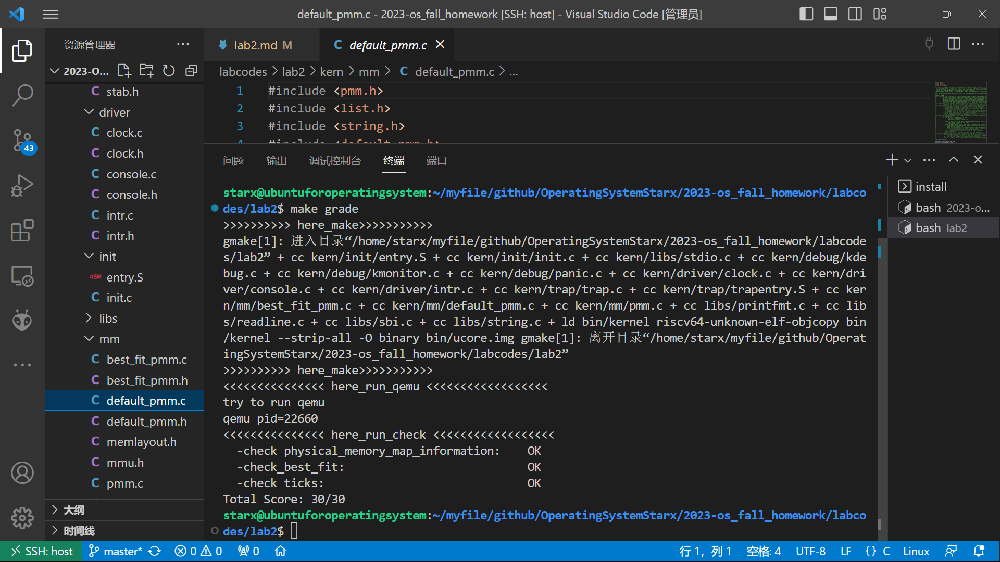

# lab2物理内存和页表

## 实验目的

- 理解页表的建立和使用方法
- 理解物理内存的管理方法
- 理解页面分配算法

## 实验内容

实验一过后大家做出来了一个可以启动的系统，实验二主要涉及操作系统的物理内存管理。操作系统为了使用内存，还需高效地管理内存资源。本次实验我们会了解如何发现系统中的物理内存，然后学习如何建立对物理内存的初步管理，即了解连续物理内存管理，最后掌握页表相关的操作，即如何建立页表来实现虚拟内存到物理内存之间的映射，帮助我们对段页式内存管理机制有一个比较全面的了解。本次的实验主要是在实验一的基础上完成物理内存管理，并建立一个最简单的页表映射。

### 练习

对实验报告的要求：
 - 基于markdown格式来完成，以文本方式为主
 - 填写各个基本练习中要求完成的报告内容
 - 完成实验后，请分析ucore_lab中提供的参考答案，并请在实验报告中说明你的实现与参考答案的区别
 - 列出你认为本实验中重要的知识点，以及与对应的OS原理中的知识点，并简要说明你对二者的含义，关系，差异等方面的理解（也可能出现实验中的知识点没有对应的原理知识点）

 本次实验的重要知识点如下：

    内存分配：内存分配是管理物理内存的过程，包括为进程分配内存块、跟踪哪些内存块已分配和哪些是可用的。包括：
        连续内存分配：将物理内存分为连续的块，适用于一些简单的系统。
        分页内存分配：将内存划分成固定大小的页面，更灵活地分配内存。

    内存回收：内存回收是将不再需要的内存块释放回系统以供其他进程使用的过程。知识点包括：
        释放策略：何时释放内存块，如何处理进程退出时的内存回收。

    碎片管理：内存分配和回收可能导致内存碎片的问题，其中有两种类型：
        外部碎片：未分配但不可用的内存块散布在系统中。
        内部碎片：已分配但未完全利用的内存块。

    地址转换：物理内存管理还涉及将进程的逻辑地址（虚拟地址）映射到物理内存地址的过程。包括：
        页表：用于虚拟地址到物理地址的映射。
        页表项：页表中的每个条目，包括页帧号和权限位。
        地址空间：每个进程都有自己的地址空间，包括代码段、数据段和堆栈段。

    内存保护：内存管理还包括保护内存不被非授权访问的机制，通常通过页表中的权限位来实现。

    页面置换算法：当物理内存不足时，操作系统需要选择哪些页面从内存中交换到磁盘以腾出空间。包括 FIFO、LRU、Clock 等页面置换算法。

    多进程管理：多个进程共享有限的物理内存，需要考虑如何公平地分配内存和避免进程之间的冲突。

    地址空间布局：操作系统定义了每个进程的地址空间布局，通常包括代码段、数据段、堆和栈。

    伙伴系统：伙伴分配算法是用于管理分配和回收内存块的方法，通过将内存分成大小相等的伙伴块来提高效率。

    大页表：为了加速地址转换，一些系统使用大页表，将多个页合并为一个更大的页
  
 - 列出你认为OS原理中很重要，但在实验中没有对应上的知识点

     进程调度算法：操作系统原理通常详细研究了各种进程调度算法，例如先来先服务（FCFS）、最短作业优先（SJF）、优先级调度、轮转调度（Round Robin）等。这些算法影响了进程如何被分配处理器时间片，但在物理内存管理实验中，通常集中在内存分配和回收。

    多线程管理：操作系统原理涵盖了多线程的管理和同步问题，包括线程创建、销毁、同步（例如互斥锁、条件变量）和调度。物理内存管理实验可能更侧重于单个进程的内存管理。

    虚拟内存：虚拟内存管理是操作系统原理中的重要主题，涉及到页面置换、分页/分段机制、地址翻译等。虽然实验中可能会讨论内存分配，但虚拟内存通常是一个更广泛的主题。

    文件系统类型：操作系统原理涵盖了不同文件系统类型的设计和实现，如FAT、NTFS、EXT等。实验可能会包括基本的文件操作，但不涵盖文件系统设计。

    中断处理：操作系统原理中会详细介绍中断和异常处理机制，包括中断向量表、异常类型、中断控制器等。实验可能会处理基本的时钟中断，但不会深入研究各种中断类型和中断向量表。

    进程通信和同步：操作系统原理包括进程间通信机制，如消息队列、信号量、管程等。物理内存管理实验通常集中在内存资源分配，而不深入研究进程间通信和同步。

#### 练习0：填写已有实验

本实验依赖实验1。请把你做的实验1的代码填入本实验中代码中有“LAB1”的注释相应部分并按照实验手册进行进一步的修改。具体来说，就是跟着实验手册的教程一步步做，然后完成教程后继续完成完成exercise部分的剩余练习。

#### 练习1：理解first-fit 连续物理内存分配算法（思考题）
first-fit 连续物理内存分配算法作为物理内存分配一个很基础的方法，需要同学们理解它的实现过程。请大家仔细阅读实验手册的教程并结合`kern/mm/default_pmm.c`中的相关代码，认真分析default_init，default_init_memmap，default_alloc_pages， default_free_pages等相关函数，并描述程序在进行物理内存分配的过程以及各个函数的作用。
请在实验报告中简要说明你的设计实现过程。请回答如下问题：
- 你的first fit算法是否有进一步的改进空间？

#### 练习2：实现 Best-Fit 连续物理内存分配算法（需要编程）
在完成练习一后，参考kern/mm/default_pmm.c对First Fit算法的实现，编程实现Best Fit页面分配算法，算法的时空复杂度不做要求，能通过测试即可。
请在实验报告中简要说明你的设计实现过程，阐述代码是如何对物理内存进行分配和释放，并回答如下问题：
- 你的 Best-Fit 算法是否有进一步的改进空间？

#### 扩展练习Challenge：buddy system（伙伴系统）分配算法（需要编程）

Buddy System算法把系统中的可用存储空间划分为存储块(Block)来进行管理, 每个存储块的大小必须是2的n次幂(Pow(2, n)), 即1, 2, 4, 8, 16, 32, 64, 128...

 -  参考[伙伴分配器的一个极简实现](http://coolshell.cn/articles/10427.html)， 在ucore中实现buddy system分配算法，要求有比较充分的测试用例说明实现的正确性，需要有设计文档。
 
#### 扩展练习Challenge：任意大小的内存单元slub分配算法（需要编程）

slub算法，实现两层架构的高效内存单元分配，第一层是基于页大小的内存分配，第二层是在第一层基础上实现基于任意大小的内存分配。可简化实现，能够体现其主体思想即可。

 - 参考[linux的slub分配算法/](http://www.ibm.com/developerworks/cn/linux/l-cn-slub/)，在ucore中实现slub分配算法。要求有比较充分的测试用例说明实现的正确性，需要有设计文档。

#### 扩展练习Challenge：硬件的可用物理内存范围的获取方法（思考题）
  - 如果 OS 无法提前知道当前硬件的可用物理内存范围，请问你有何办法让 OS 获取可用物理内存范围？

> Challenges是选做，完成Challenge的同学可单独提交Challenge。完成得好的同学可获得最终考试成绩的加分。